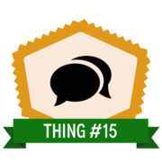

# Thing 15: Data management plans

**[Jump to Thing 16&gt;&gt;](thing-16.md)**

Some research institutions and research funders now require researchers
to submit a Data Management Plan (DMP) for new projects. What should a
DMP cover? Could you help with one?

-   **Getting started**: What’s a DMP?
-   **Learn more**: Why machine-actionable DMPs?
-   **Challenge me**: Exploring DMP Tools

[Find out about the work of the Australasian DMP Interest
Group](http://www.ands.org.au/partners-and-communities/ands-communities/dmps-interest-group)

* [Getting started](#getting-started)
* [Learn more](#learn-more)
* [Challenge me](#challenge-me)

## Getting started 

### An introduction to Data Management Plans

A Data Management Plan (DMP) documents how data will be managed, stored
and shared during and after a research project. Some research funders
are now requesting that researchers submit a DMP as part of their
project proposal.

1.  Start by scanning this short introduction to [Data Management
    Plans](https://www.ands.org.au/working-with-data/data-management/data-management-plans)
2.  Now browse through some public DMPs from either  the CDL or DataOne,
    and open up one or two of the DMPs to see the type of information
    they capture:

-   [California Digital
    Library](https://dmptool.org/public_plans "DMP tool - public DMP plans")
-   [DataOne](https://www.dataone.org/data-management-planning)
-   [NEH
    DMPs](https://www.neh.gov/divisions/odh/grant-news/data-management-plans-successful-grant-applications-2011-2014-now-available) -
    specialising in DMPs of Humanities Research Projects

**Consider:** You will have noticed that DMPs can be very short, or
extremely long and complex. What do you think are the two or three
pieces of information essential to include in every DMP and why?

Do you have a question?  Want to share a resource?
- Post to the [Data Librarians Slack group](https://tiny.cc/data-librarians) to connect with the community.
- Tweet to [@ardc_au](https://twitter.com/ARDC_AU) using hashtag#23things

Completion of Thing 15 means you've earned a digital badge!

[Claim your badge](https://credly.com/claim/66861/7E4-ABD9-344)

Go to [Thing 16](thing-16.md "thing 16")
What are Publishers and Funders saying about data? or to [All Things](index.md)

## Learn more

### Templates for Data Management Plans

Imagine if the information contained in a DMP could flow across other
systems automatically (e.g. to populate faculty profiles, monitor
grants, notify repositories of data in the pipeline) and reduce
administrative burdens. 

What if DMPs were part of active research workflows, and served to
connect researchers with tailored guidance and resources at appropriate
points over the course of a project?

Machine actionable DMPs will help make this possible.
*Machine-actionable* “refers to information that is structured in a
consistent way so that machines, or computers, can be programmed against
the structure” ([DDI
definition](https://www.ddialliance.org/taxonomy/term/198)).

1.  Read up on how the international community is re-thinking DMPs in
    the [White paper on machine-actionable Data Management
    Plans](http://riojournal.com/articles.php?id=13086). This White
    Paper is long, but incredibly rich - scroll down for lots of
    use-cases, interoperability, data discovery and more.
2.  Check out how The University of Queensland is re-imagining DMPs in
    the blog post [DMRs, making DMP’s relevant
    again](http://andscentral.blogspot.com.au/2017/05/dmrs-making-dmps-relevant-again.html).

**Consider:** Do you think machine-actionable DMPs will make them more
valuable to researchers? Institutions? Funders?

Do you have a question?  Want to share a resource?

-   Post to the[Data Librarians Google
    Group](https://plus.google.com/u/0/communities/105455769899183786145)
    to connect with the community.
-   Tweet to
    [@ands\_nectar\_rds](http://twitter.com/ands_nectar_rds "ANDS Nectar RDS on Twitter")

------------------------------------------------------------------------

Completion
of Thing 15 means you've earned a digital badge!

[**Claim your
badge**](https://credly.com/claim/66861/7E4-ABD9-344 "Credly")

Go to [**Thing
16**](https://www.ands.org.au/working-with-data/skills/23-research-data-things/all23/thing-16)
: What are Publishers and Funders saying about data?

------------------------------------------------------------------------

**Thing 15: Data management plans**

**Challenge me: ** Data Management Plans for the Humanities

DMP tools enable researchers to create, review, and share data
management plans that meet institutional and funder requirements. To
make DMPs more useful and effective, these tools are being re-imagined
in new ways.

1.  First have a look at the [The DMPTool: A Brief Overview 90 sec
    video](https://amara.org/en/videos/IKdDSX3JLQT2/info/dmptool2-promotional-video/ "DMP overview video")
    to see what the DMPTool offers researchers and institutional data
    managers
2.  Then read [this
    blog](https://blog.dmptool.org/category/roadmap-project) about how
    the Digital Curation Centre UK (DCC) and University of California
    Curation Centre (UCCC) have joined forces to create a new tool,
    called DMPRoadmap.
3.  Next browse the DMPRoadmap [development
    wiki](https://github.com/DMPRoadmap/roadmap/wiki/Development-roadmap)
    on GitHub.

**Consider:** The DMPRoadmap project is aiming to enable DMP’s to be
active, dynamic, machine-readable and FAIR. Can you suggest additional
goals or further enhancements?

[Find out about the work of the Australasian DMP Interest
Group](http://www.ands.org.au/partners-and-communities/ands-communities/dmps-interest-group)

Do you have a question?  Want to share a resource?

-   Post to the[Data Librarians Google
    Group](https://plus.google.com/u/0/communities/105455769899183786145)
    to connect with the community.
-   Tweet to
    [@ands\_nectar\_rds](http://twitter.com/ands_nectar_rds "ANDS Nectar RDS on Twitter")

------------------------------------------------------------------------

Completion
of Thing 15 means you've earned a digital badge!

[**Claim your
badge**](https://credly.com/claim/66861/7E4-ABD9-344 "Credly")

Go to [**Thing
16**](https://www.ands.org.au/working-with-data/skills/23-research-data-things/all23/thing-16)
: What are Publishers and Funders saying about data?

------------------------------------------------------------------------

-   

    ### Let's talk data

    Data conversations make sense - ensuring data is an asset.

    

    -   [Thing
        15:](https://www.ands.org.au/working-with-data/skills/23-research-data-things/all23/thing-15)
        Data management plans
    -   [Thing
        16:](https://www.ands.org.au/working-with-data/skills/23-research-data-things/all23/thing-16)
        Publishers & funders
    -   [Thing
        17:](https://www.ands.org.au/working-with-data/skills/23-research-data-things/all23/thing-17)
        Literacy & outreach
    -   [Thing
        18:](https://www.ands.org.au/working-with-data/skills/23-research-data-things/all23/thing-18)
        Data interviews

    

<!-- -->

-   

    [\#23RDThings
    Tweets](https://twitter.com/hashtag/23RDThings){.twitter-timeline}

    

<!-- -->

-   

    ### ANDS newsletter

    

    ANDS-Nectar-RDS News is a fortnightly newsletter featuring news,
    events and jobs. Don't miss out!

    -   [Subscribe](http://ands.us7.list-manage1.com/subscribe?u=b542ef52e49302569068046d9&id=22b849a4ee)

    

in [Skills](https://www.ands.org.au/working-with-data/skills)

-   [Skills](https://www.ands.org.au/working-with-data/skills)
-   [Domain specific
    training](https://www.ands.org.au/working-with-data/skills/domain "Domain specific training")
-   [For data
    trainers](https://www.ands.org.au/working-with-data/skills/datatrainers "For data trainers")
-   [Multi-day data and research skills
    training](https://www.ands.org.au/working-with-data/skills/Multi-day-data-and-research-skills-training "Multi-day data and research skills training")
-   [23 (research data)
    Things](https://www.ands.org.au/working-with-data/skills/23-research-data-things "23 (research data) Things")
    -   [Things 1 to
        23](https://www.ands.org.au/working-with-data/skills/23-research-data-things/all23 "Things 1 to 23")
        -   [Thing 1: Getting started with research
            data](https://www.ands.org.au/working-with-data/skills/23-research-data-things/all23/thing-1 "Thing 1: Getting started with research data")
        -   [Thing 2: Issues in research data
            management](https://www.ands.org.au/working-with-data/skills/23-research-data-things/all23/thing-2 "Thing 2: Issues in research data management")
        -   [Thing 3: Data in the research
            lifecycle](https://www.ands.org.au/working-with-data/skills/23-research-data-things/all23/thing-3 "Thing 3: Data in the research lifecycle")
        -   [Thing 4: Data
            discovery](https://www.ands.org.au/working-with-data/skills/23-research-data-things/all23/thing-4 "Thing 4: Data discovery")
        -   [Thing 5: Data
            sharing](https://www.ands.org.au/working-with-data/skills/23-research-data-things/all23/thing-5 "Thing 5: Data sharing")
        -   [Thing 6: Long-lived data: curation &
            preservation](https://www.ands.org.au/working-with-data/skills/23-research-data-things/all23/thing-6 "Thing 6: Long-lived data: curation & preservation")
        -   [Thing 7: Data citation for access &
            attribution](https://www.ands.org.au/working-with-data/skills/23-research-data-things/all23/thing-7 "Thing 7: Data citation for access & attribution")
        -   [Thing 8: DOIs and citation metrics for
            data](https://www.ands.org.au/working-with-data/skills/23-research-data-things/all23/thing-8 "Thing 8: DOIs and citation metrics for data")
        -   [Thing 9: Licensing data for
            reuse](https://www.ands.org.au/working-with-data/skills/23-research-data-things/all23/thing-9 "Thing 9: Licensing data for reuse")
        -   [Thing 10: Sharing sensitive
            data](https://www.ands.org.au/working-with-data/skills/23-research-data-things/all23/thing-10 "Thing 10: Sharing sensitive data")
        -   [Thing 11: What's my metadata
            schema?](https://www.ands.org.au/working-with-data/skills/23-research-data-things/all23/thing-11 "Thing 11: What's my metadata schema?")
        -   [Thing 12: Vocabularies for data
            description](https://www.ands.org.au/working-with-data/skills/23-research-data-things/all23/thing-12 "Thing 12: Vocabularies for data description")
        -   [Thing 13: Walk the
            crosswalk](https://www.ands.org.au/working-with-data/skills/23-research-data-things/all23/thing-13 "Thing 13: Walk the crosswalk")
        -   [Thing 14: Identifiers and linked
            data](https://www.ands.org.au/working-with-data/skills/23-research-data-things/all23/thing-14 "Thing 14: Identifiers and linked data")
        -   [Thing 15: Data management
            plans](https://www.ands.org.au/working-with-data/skills/23-research-data-things/all23/thing-15 "Thing 15: Data management plans")
        -   [Thing 16: What are publishers & funders saying about
            data?](https://www.ands.org.au/working-with-data/skills/23-research-data-things/all23/thing-16 "Thing 16: What are publishers & funders saying about data?")
        -   [Thing 17: Data literacy &
            outreach](https://www.ands.org.au/working-with-data/skills/23-research-data-things/all23/thing-17 "Thing 17: Data literacy & outreach")
        -   [Thing 18: Data interviews: talk the
            talk](https://www.ands.org.au/working-with-data/skills/23-research-data-things/all23/thing-18 "Thing 18: Data interviews: talk the talk")
        -   [Thing 19: Exploring APIs and
            Apps](https://www.ands.org.au/working-with-data/skills/23-research-data-things/all23/thing-19 "Thing 19: Exploring APIs and Apps")
        -   [Thing 20: Find it with
            data!](https://www.ands.org.au/working-with-data/skills/23-research-data-things/all23/thing-20 "Thing 20: Find it with data!")
        -   [Thing 21: Tools of the
            trade](https://www.ands.org.au/working-with-data/skills/23-research-data-things/all23/thing-21 "Thing 21: Tools of the trade")
        -   [Thing 22: What's in a
            name?](https://www.ands.org.au/working-with-data/skills/23-research-data-things/all23/thing-22 "Thing 22: What's in a name?")
        -   [Thing 23: Making
            connections](https://www.ands.org.au/working-with-data/skills/23-research-data-things/all23/thing-23 "Thing 23: Making connections")
    -   [10 medical and health
        Things](https://www.ands.org.au/working-with-data/skills/23-research-data-things/10-medical-and-health-things "10 medical and health Things")
        -   [Medical & health Thing 1 Getting started with research
            data](https://www.ands.org.au/working-with-data/skills/23-research-data-things/10-medical-and-health-things/m-and-h-thing-1 "Medical & health Thing 1: Getting started with research data")
        -   [Medical & health Thing 2 Issues in research data
            management](https://www.ands.org.au/working-with-data/skills/23-research-data-things/10-medical-and-health-things/m-and-h-thing-2 "Medical & health Thing 2: Issues in research data management")
        -   [Medical & health Thing 3 Data sharing and
            discovery](https://www.ands.org.au/working-with-data/skills/23-research-data-things/10-medical-and-health-things/m-and-h-thing-3 "Medical & health Thing 3: Data sharing and discovery")
        -   [Medical & health Thing 4 Sharing sensitive
            data](https://www.ands.org.au/working-with-data/skills/23-research-data-things/10-medical-and-health-things/m-and-h-thing-4 "Medical & health Thing 4: Sharing sensitive data")
        -   [Medical & health Thing 5 What are publishers and funders
            saying about
            data?](https://www.ands.org.au/working-with-data/skills/23-research-data-things/10-medical-and-health-things/m-and-h-thing-5 "Medical & health Thing 5: What are publishers and funders saying about data?")
        -   [Medical & health Thing 6 Identifiers for data and
            people](https://www.ands.org.au/working-with-data/skills/23-research-data-things/10-medical-and-health-things/m-and-h-thing-6 "Medical & health Thing 6: Identifiers for data and people")
        -   [Medical & health Thing 7 Data citation for access &
            attribution](https://www.ands.org.au/working-with-data/skills/23-research-data-things/10-medical-and-health-things/m-and-h-thing-7 "Medical & health Thing 7: Data citation for access & attribution")
        -   [Medical & health Thing 8 Licensing data for
            reuse](https://www.ands.org.au/working-with-data/skills/23-research-data-things/10-medical-and-health-things/m-and-h-thing-8 "Medical & health Thing 8: Licensing data for reuse")
        -   [Medical & health Thing 9 Describing data: metadata and
            controlled
            vocabularies](https://www.ands.org.au/working-with-data/skills/23-research-data-things/10-medical-and-health-things/m-and-h-thing-9 "Medical & health Thing 9: Describing data: metadata and controlled vocabularies")
        -   [Medical & health Thing 10 Planning to
            publish](https://www.ands.org.au/working-with-data/skills/23-research-data-things/10-medical-and-health-things/m-and-h-thing-10 "Medical & health Thing 10: Planning to publish")
    -   [Celebration](https://www.ands.org.au/working-with-data/skills/23-research-data-things/celebration "Celebration")
    -   [Re-purpose
        toolkit](https://www.ands.org.au/working-with-data/skills/23-research-data-things/toolkit "Re-purpose toolkit")
    -   [Resources](https://www.ands.org.au/working-with-data/skills/23-research-data-things/resources "Resources")
    -   [FAQs- 23 (research data)
        Things](https://www.ands.org.au/working-with-data/skills/23-research-data-things/faq "FAQs- 23 (research data) Things")
-   [Technical data
    skills](https://www.ands.org.au/working-with-data/skills/tech "Technical data skills")

[[Twitter]{.visuallyhidden}](https://twitter.com/andsdata)
[[YouTube]{.visuallyhidden}](http://www.youtube.com/user/andsdata)

-   Quick Links
    -----------

    -   [Research Data
        Australia](https://www.ands.org.au/online-services/research-data-australia)
    -   [RDA Content Providers
        Guide](https://documentation.ands.org.au/display/DOC/Content+Providers+Guide "RDA CPG")
    -   [Latest
        news](https://www.ands.org.au/news-and-events/latest-news)
    -   [Guides](https://www.ands.org.au/guides)
    -   *[Share](https://www.ands.org.au/news-and-events/share-newsletter)*[newsletter](https://www.ands.org.au/news-and-events/share-newsletter)
    -   [Events
        calendar](https://www.ands-nectar-rds.org.au/events "events ands-nectar-rds")

-   Important Links
    ---------------

    -   [About ANDS](https://www.ands.org.au/about-us)
    -   [Contact us](https://www.ands.org.au/contact-us)
    -   [Image credits and
        site reuse](https://www.ands.org.au/home/reusing-this-site)
    -   [Using our
        logo](https://www.ands.org.au/about-us/using-our-logo)
    -   [Legal and
        accessibility](https://www.ands.org.au/home/legal-and-accessibility)

-   ANDS Collaborating Partners
    ---------------------------

    -   
    -   
    -   

    Monash University is the Lead Agent of ANDS

-   -   

        ANDS is supported by the Australian Government through the
        National Collaborative Research Infrastructure Strategy program.

    -   

        With the exception of logos or where otherwise indicated, this
        work is licensed under the [Creative Commons 4.0 International
        Attribution
        Licence](https://creativecommons.org/licenses/by/4.0/).

    -   

        ANDS, [Nectar](https://nectar.org.au) and
        [RDS](https://www.rds.edu.au) has combined to form the
        Australian Research Data Commons (ARDC).

<!-- -->

-   Quick Links
    -----------

    -   [Research Data
        Australia](https://www.ands.org.au/online-services/research-data-australia)
    -   [RDA Content Providers
        Guide](https://documentation.ands.org.au/display/DOC/Content+Providers+Guide "RDA Content Providers Guide")
    -   [Latest
        news](https://www.ands.org.au/news-and-events/latest-news)
    -   [Guides](https://www.ands.org.au/guides)
    -   *[Share](https://www.ands.org.au/news-and-events/share-newsletter)*[newsletter](https://www.ands.org.au/news-and-events/share-newsletter)
    -   [Events
        calendar](https://www.ands-nectar-rds.org.au/events "events ands-nectar-rds")

-   Important Links
    ---------------

    -   [About ANDS](https://www.ands.org.au/about-us)
    -   [Contact us](https://www.ands.org.au/contact-us)
    -   [Image credits and site
        reuse](https://www.ands.org.au/home/reusing-this-site)
    -   [Using our
        logo](https://www.ands.org.au/about-us/using-our-logo)
    -   [Legal and
        accessibility](https://www.ands.org.au/home/legal-and-accessibility)

-   ANDS Collaborating Partners
    ---------------------------

    -   
    -   
    -   

    Monash University is the Lead Agent of ANDS

-   -   

        ANDS is supported by the Australian Government through the
        National Collaborative Research Infrastructure Strategy program.

    -   

        With the exception of logos or where otherwise indicated, this
        work is licensed under the [Creative Commons Australia
        Attribution 4.0
        Licence](https://creativecommons.org/licenses/by/4.0/).

    -   

        ANDS, [Nectar](https://nectar.org.au) and
        [RDS](https://www.rds.edu.au) has combined to form the
        Australian Research Data Commons (ARDC).

