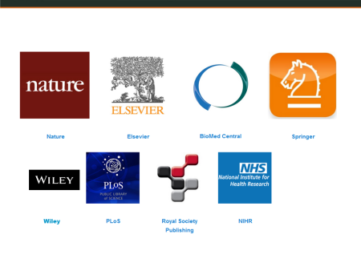

# Thing 16: What are publishers & funders saying about data?

**[Jump to Thing 17&gt;&gt;](thing-17.md)**

Data sharing policies are becoming increasingly common in Australia and
internationally.  Learn why research funders and journal publishers are
particularly influential when it comes to encouraging data availability.

-   **Getting started**: experience what it’s like to navigate journal
    data policies
-   **Learn more**: this newly announced journal data policy might
    affect data around the globe...
-   **Challenge me**: 2020 vision about the future of data and funders

* [Getting started](#getting-started)
* [Learn more](#learn-more)
* [Challenge me](#challenge-me)

## Getting started
### Two choices for Thing 16!

Two exciting things are happening with data and journal publishers. More
and more journal publishers are asking authors to make the
data underpinning a journal article available. And, new forms of data
publishing are emerging: data journals.

It’s all about ensuring that the research being described in the article
is based on solid, reproducible science. Thinking back to [Thing 5: Data
Sharing](thing-5.md), remember that *available* can be “open” or “shared” through mediated
access.

### Choice 1: Journal data policies

More and more publishers are suggesting, asking and even mandating that
underpinning data be available to support journal articles. Choose one
of the links below to explore some of these policies.

1.  PLOS One [data
    policy](http://journals.plos.org/plosone/s/data-availability)
2.  [Dryad](http://datadryad.org/pages/jdap "Dryad") is an data
    repository which integrates data and articles. It lists how and when
    to submit your data for 111 journals
3.  Look up a journal you know and see what the advice the journal gives
    on related data

**Consider:** How easy, or hard, it was for you to understand what you
had to do in regard to research data?

### Choice 2: Data journals

Explore a new form of data publishing: the data journal. Data journals
focus on data, rather than discuss an analysis of the data (as in
traditional journals).

1.  Read this short introduction: [What are data
    journals?](https://www.ands.org.au/working-with-data/publishing-and-reusing-data/data-journals#dj "Data and Journals")
2.  Browse this [data paper](http://www.nature.com/articles/sdata201647)
    published in Nature’s data journal: *Scientific Data,* on how and
    why the Chinese population has been on the move in the past 70
    years. Note the extensive exposure of the data through maps, links
    to full tables, and diagrams etc. and how to cite this article.
    Clicking on the DOI under *Data Citations* will take you to the
    actual data described in the article.

**Consider:** Why do you think authors might choose to share their data
in data journals rather than, or in addition to, traditional journal
formats?

Do you have a question?  Want to share a resource?
- Post to the [Data Librarians Slack group](https://tiny.cc/data-librarians) to connect with the community.
- Tweet to [@ardc_au](https://twitter.com/ARDC_AU) using hashtag#23things

Completion of Thing 16 means you've earned a digital badge!

[Claim your badge](https://credly.com/claim/66863/43B-EF86-1FF "Credly")

Go to [Thing 17](thing-17.md "thing 17")
Issues in research data management or to [All Things](index.md)

## Learn more 
### Planning to publish: research data

The number of funders, journals/publishers and institutions implementing
a research data policy is growing. However the landscape is complex and
implications of policies for researchers can be unclear.

1.  Start by reading about global publisher Springer Nature’s
    introduction of a standardisation research data policy framework
    with four data policy types by reading this blog post, [Over 600
    Springer Nature journals commit to new data sharing
    policies](https://group.springernature.com/gp/group/media/press-releases/archive-2016/over-600-springer-nature-journals-commit-to-new-data-sharing-policies/12000254).  
2.  Learn about international efforts to standardise journal data
    policies through the Research Data Alliance [Interest Group on Data
    Policy Standardisation and
    Implementation](https://www.rd-alliance.org/groups/data-policy-standardisation-and-implementation)

**Consider:** your top three pieces of advice for a young researcher
aiming to publish in one of the Springer journals which has a Type 3 or
Type 4 data sharing policy. Hint: think about
what needs to be considered at the start of a research project to enable
data sharing upon publication at the end.

Do you have a question?  Want to share a resource?
- Post to the [Data Librarians Slack group](https://tiny.cc/data-librarians) to connect with the community.
- Tweet to [@ardc_au](https://twitter.com/ARDC_AU) using hashtag#23things

Completion of Thing 16 means you've earned a digital badge!

[Claim your badge](https://credly.com/claim/66863/43B-EF86-1FF "Credly")

Go to [Thing 17](thing-17.md "thing 17")
Issues in research data management or to [All Things](index.md)

## Challenge me
### Research funders and data sharing

The Australian National Health and Medical Research Council (NHMRC)
funded more than \$896 million (2015) for health and medical research
including 1030 new grants to universities, medical research institutions
and hospitals across Australia.

1\. Start by reading the [NHMRC Open Access
Policy](https://www.nhmrc.gov.au/about-us/resources/open-access-policy)
(section 3.2 and Appendix 2) and note the lifecycle diagram for data
sharing.

2\. Then choose one of these major funders of research overseas and have
a look at their data sharing policies:

-   [National Science
    Foundation](http://www.nsf.gov/bfa/dias/policy/dmp.jsp) in the US,
    and note the Data Management Plan requirement (see [Thing 15:
    DMPs](thing-16.md))
-   [Wellcome
    Trust](https://wellcome.ac.uk/funding/managing-grant/policy-data-management-and-sharing)
    in the UK (1 page)

Now, imagine it is 2020… **consider** what you think Australian research
funders will be requiring of researchers who are seeking project
funding. What does this mean for those working in data support areas?

Do you have a question?  Want to share a resource?
- Post to the [Data Librarians Slack group](https://tiny.cc/data-librarians) to connect with the community.
- Tweet to [@ardc_au](https://twitter.com/ARDC_AU) using hashtag#23things

Completion of Thing 16 means you've earned a digital badge!

[Claim your badge](https://credly.com/claim/66863/43B-EF86-1FF "Credly")

Go to [Thing 17](thing-17.md "thing 17")
Issues in research data management or to [All Things](index.md)

